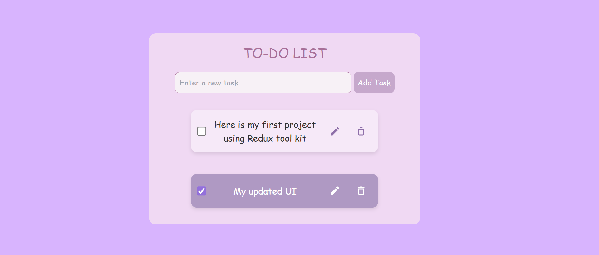

# Todo App with React and Redux Toolkit

## Overview

This is a Todo application built with React and Redux Toolkit. It provides a user-friendly interface for managing tasks, allowing users to add, edit, complete, and delete todos. The application uses `localStorage` to persist data across sessions.

   <!-- Update this path to match where you place your screenshot -->

## Features

- **Add Todos**: Add new tasks to your list.
- **Edit Todos**: Modify existing tasks with inline editing.
- **Complete/Uncomplete Tasks**: Toggle the completion status of tasks.
- **Delete Todos**: Remove tasks from the list.
- **Persistent Storage**: Todos are saved in `localStorage` to ensure persistence across page reloads.

## Technologies Used

- **React**: For building the user interface.
- **Redux Toolkit**: For state management.
- **localStorage**: For data persistence.

## Live Demo

Check out the live demo of the application at: [Todo List RTK Live Demo](https://todo-list-rtk-psi.vercel.app/)
